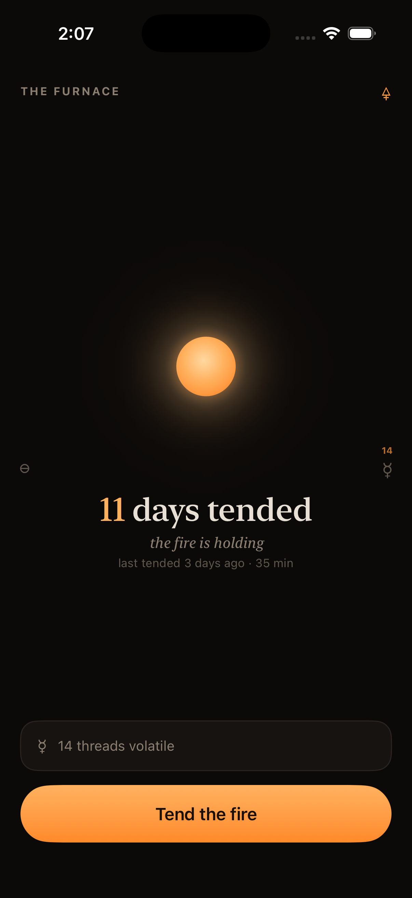
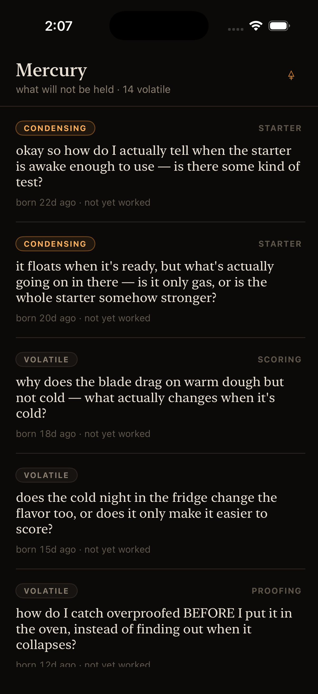
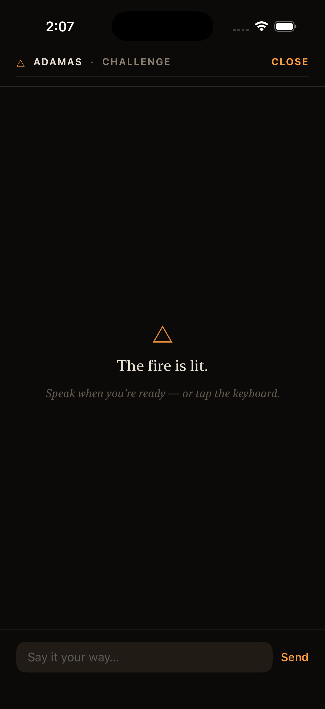
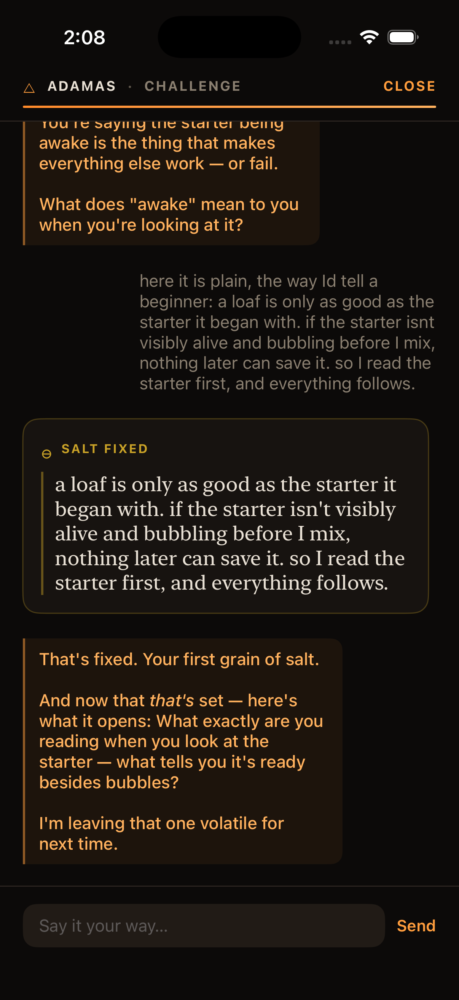
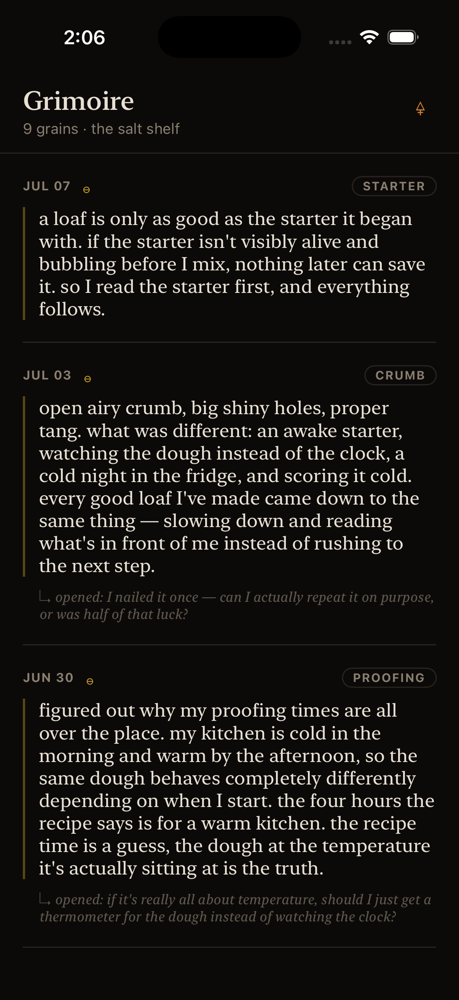
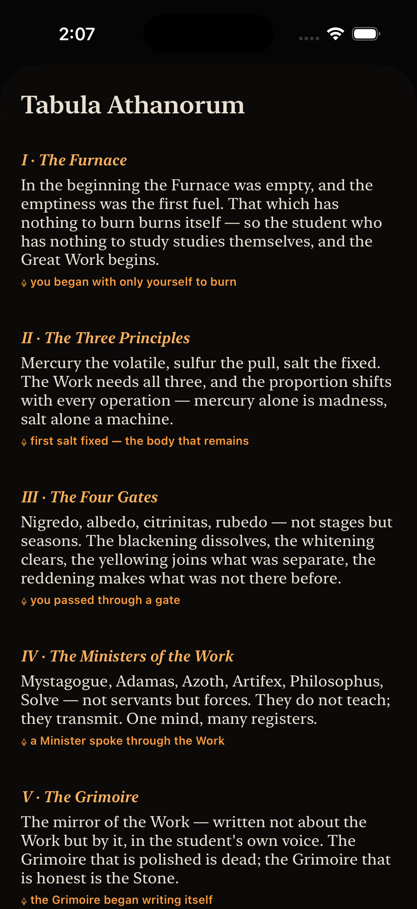

# Athanor

*An athanor is the slow furnace an alchemist keeps at a steady heat for weeks —
the fire you tend so the work can happen. This one fits in your pocket.*

Athanor is a voice-first iOS practice app: a personal mystery school with one
teacher. You speak; a guide called the **Mystagogue** answers in short Socratic
turns, never lecturing, always asking the question under your question. When
something you say lands as true — in *your own words*, not the teacher's — it is
**fixed as salt**: a permanent grain in your Grimoire. The questions you can't
answer yet stay **volatile as mercury**, a pool of open threads waiting to be
worked. There are no streaks, no points, no notifications competing for you. The
only number that accumulates is **days tended** — because a fire only stays lit
if someone keeps showing up to it.

It runs entirely on the phone. No server, no account: the agent loop, the store,
and the voice model all live on the device.

## The loop

A session is small — a few minutes of real thinking. Here is the whole arc,
walked by *Sam*, a fictional home baker three weeks into sourdough (the built-in
`normy` demo seed).

**The Furnace** is home. The fire, the days you've tended, and a quiet ring of
doors — no tab bar, just a room you turn through.



**Mercury** holds what will not be held: open questions, each still volatile or
beginning to condense. This is the working pool the Mystagogue draws from.



**A session** opens under one of the teacher's registers — here *Adamas*, the
challenging voice. Speak when you're ready, or type. The fire is lit.



**The condensation.** Sam says something plainly true, and the Mystagogue
catches it — *salt fixed*, the first grain, in Sam's own phrasing. Then it hands
back the next volatile question rather than closing the loop. This gold moment is
the heart of the app.



**The Grimoire** is the salt shelf: every fixed grain, dated, in the learner's
voice, each trailing the new question it opened. Written *by* the work, not about
it.



The vocabulary is not decoration — it's the model. The **Tabula Athanorum**, a
scroll you can pull up, is the app explaining itself in its own register:



## How it's built

A Rust core owns everything that matters; the Swift layer only renders it.

- **`crates/athanor-core`** — the domain. A *tria prima* (salt / mercury /
  sulfur) SQLite store with migrations, the session state machine (the
  *Conductor*), prompt assembly, and the Mystagogue's in-process tools
  (`fix_salt`, `shift_mask`, …). Wisdom only advances from a real exchange —
  invariants like that live here, tested, not in the UI.
- **Embedded [goose](https://github.com/aaif-goose/goose) agent** (pinned fork of
  Block's goose) — the Mystagogue is
  a goose agent running *in-process*, driving Claude with tools that call
  straight into the store. No round-trip to a backend. A field report on getting
  goose to embed cleanly on iOS lives in
  [`docs/research/goose-embedding-feedback.md`](docs/research/goose-embedding-feedback.md).
- **Embedded whisper** (`crates/stt`) — the *Bellows*: streaming on-device
  speech-to-text, feature-gated so the default test tier stays hermetic.
- **`crates/ffi`** — a UniFFI 0.31 bridge, the one crate that knows about
  bindings, into an **Ember**-styled SwiftUI shell (`apps/ios`) that renders
  state and owns no logic.
- **Prompts are snapshot-locked.** The teacher's registers live in versioned
  prompt packs (`crates/athanor-core/prompts`) pinned by snapshot tests, and an
  **eval harness** (`crates/evals`) runs learner personas against them — so a
  change to how the Mystagogue speaks is a diff you can review, not a vibe.

## Running it

**Demo mode needs no key.** Built without an `ANTHROPIC_API_KEY`, the app runs a
canned `DemoEngine` — the whole shell, real navigation, scripted replies. The
zero-friction way to see it.

Simulator quickstart:

```sh
cd apps/ios
./build-ffi.sh          # from a normal login shell, NOT inside `nix develop`:
                        # builds the Rust core into an xcframework
./generate.sh           # generates Athanor.xcodeproj (reads .env if present)
open Athanor.xcodeproj  # build & run on an iPhone simulator
```

For the **live Mystagogue**, put `ANTHROPIC_API_KEY=…` in a repo-root `.env`
before `generate.sh` (it is shell-sourced only, never committed). For a lived-in
demo, seed the fictional `normy` learner:

```sh
cargo run -p athanor-cli -- seed --profile normy --db /tmp/normy.sqlite
```

Running on a real device is a longer path — see
[`docs/device-install.md`](docs/device-install.md).

## Status

A personal project, built in the open — publish-the-process. It moves fast and
changes shape; there are no support promises and no stability guarantees. If
you're here to read how it's made, start with
[`docs/agent-brief.md`](docs/agent-brief.md) and
[`docs/invariants.md`](docs/invariants.md).
